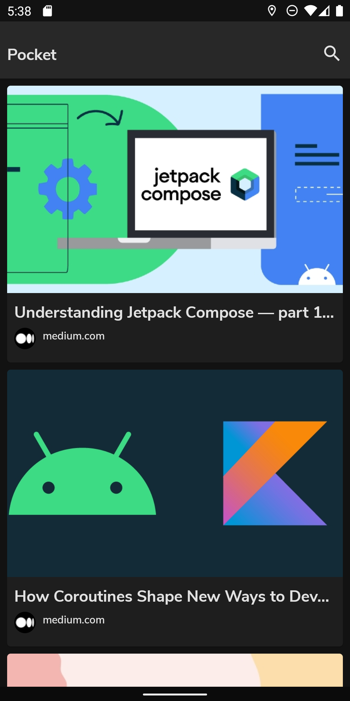
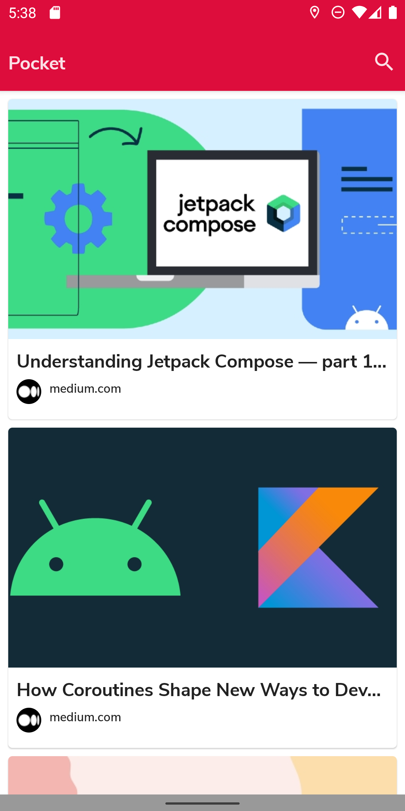
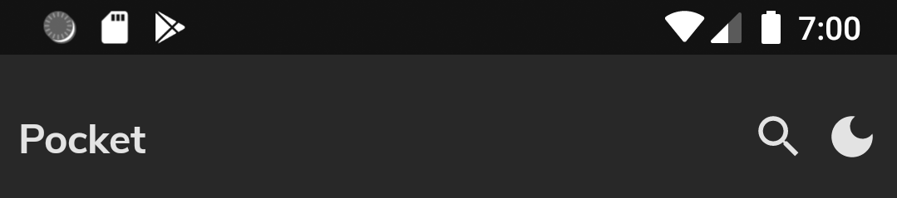
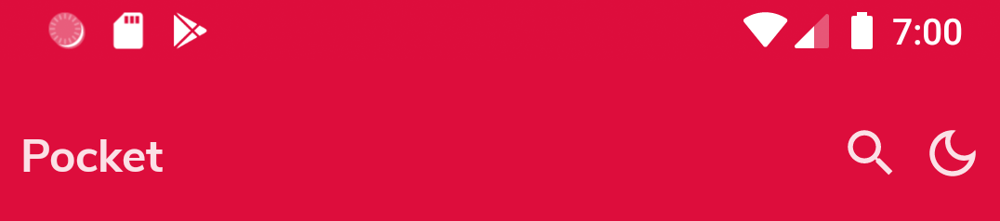

# Pocket

This app mimics the functionality of the popular [Pocket](https://play.google.com/store/apps/details?id=com.ideashower.readitlater.pro&hl=en_IN&gl=US) app
which is available to download in the play store. To try out this app you need to use the latest version of [Android Studio Arctic Fox](https://developer.android.com/studio/preview). The main aim of this app was to test the applicability of compose in small sized apps. There is no intention of releasing this app to the play store. The app has reached a 'stable' and 'usable' state. But, testing the app was not the main focus. Hence, bugs are bound to exist.

## Table of contents
1. [Demo](#demo)
2. [Screenshots](#screenshots)
3. [Tech Stack](#tech-stack)
4. [Some notable features](#some-notable-features)
5. [Source code and architecture](#source-code-and-architecture)

## Demo
https://user-images.githubusercontent.com/54663474/183364434-455040a6-8662-4db8-bc10-579dff9001fa.mp4

## Screenshots

### Home Screen (Dark/Light mode)
 

### Welcome, Login and Signup Screen (Dark mode)
 &nbsp;  &nbsp; 

### Welcome,Login and Signup Screen (Light mode)
 &nbsp;  &nbsp; 

### Top bar (API < 29)
The top bar will display the option to change the theme if, and only if, the device' current android
version doesn't support dark mode.If it supports dark mode, then the theme of the app will match the
current system theme.

#### Dark mode

#### Light mode

## Tech stack
- Entirely written in [Kotlin](https://kotlinlang.org/).
- [Hilt](https://www.google.com/url?client=internal-element-cse&cx=000521750095050289010:zpcpi1ea4s8&q=https://developer.android.com/training/dependency-injection/hilt-android&sa=U&ved=2ahUKEwiW5omeu6z4AhWRR2wGHVUsCo0QFnoECAMQAQ&usg=AOvVaw3dCbP79C6od3KVCnJub3v0) for dependency injection.
- [Jetpack Compose](https://developer.android.com/jetpack/compose) for building the UI.
- [Kotlin Coroutines](https://kotlinlang.org/docs/reference/coroutines/coroutines-guide.html) for
  threading.
- [Room](https://developer.android.com/training/data-storage/room) for database.
- [Timber](https://github.com/JakeWharton/timber) for logging.
- [DataStore](https://developer.android.com/topic/libraries/architecture/datastore?gclid=EAIaIQobChMItJiD6eTG8QIVQTUrCh0OSAGpEAAYASAAEgJ5H_D_BwE&gclsrc=aw.ds)
  for storing user preferences.
- [Glide](https://github.com/bumptech/glide) for image loading.
- [Jsoup](https://jsoup.org/) for parsing the website.
- [Work Manager](https://developer.android.com/topic/libraries/architecture/workmanager?gclid=EAIaIQobChMIwJy33ufG8QIVGcEWBR31Mwa-EAAYASAAEgIF3vD_BwE&gclsrc=aw.ds)
  for background tasks.
- [Firebase Authentication](https://firebase.google.com/docs/auth) for user account creation and authentication.
- [Accompanist](https://google.github.io/accompanist/) for navigation animations,pager and pager indicators.

## Some notable features
- Save URL's from any web browser using the share menu.
- Dark and light mode support.
- The app's theme matches the current system theme for all devices above API level 29 (Android 10).
- Ability to search through the list of saved urls.
- The user's theme preference will be saved, and it will be applied everytime the app is re-opened (
  API level < 29).
- 'Loading' and 'refreshing' banners in the home screeen to notify the user that the list is in the process of being updated.

## Source code and architecture
- [Architecture components](https://developer.android.com/topic/libraries/architecture/) such as
  Room,Lifecycle and ViewModels are used.
- [MVVM](https://developer.android.com/jetpack/guide?gclid=EAIaIQobChMI-_GIsejG8QIVzNaWCh0NXQANEAAYASAAEgKZ2fD_BwE&gclsrc=aw.ds)
  architecture is used.
- Source code conforms to
  the [Kotlin coding conventions](https://kotlinlang.org/docs/coding-conventions.html).
- [Material design color system](https://material.io/design/color/the-color-system.html#color-usage-and-palettes)
  specification is used for assigning colors to the UI components.
- Commit messages follow
  the [Angular specification](https://github.com/angular/angular/blob/22b96b9/CONTRIBUTING.md#-commit-message-guidelines)
  for commit messages._(Note:Some early commits do not follow this convention.)_
